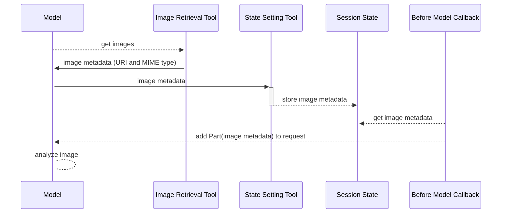

# Processing images located on a Cloud Storage bucket

How can an agent process these images? Simply providing the URLs of the files to the model doesn't
work - the Gemini models don't know how to access these images. But Gemini models can process
so-called multimodal context if we provide it with the right Part.
See [product documentation](https://cloud.google.com/vertex-ai/generative-ai/docs/model-reference/inference#sample-requests-text-gen-multimodal-prompt)
for details.

Currently, ADK doesn't provide a native way to send Parts other than "text". A callback or a plug-in
can be used to add the required part to the LLM request. Here's at the high level how it can be done:

