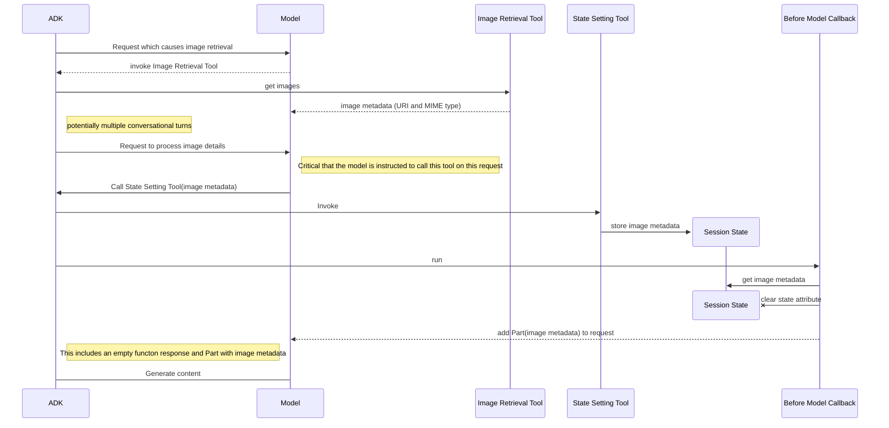

# Processing images located on a Cloud Storage bucket

How can an agent process these image? Simply providing the URL of the file to the model in a plain
text prompt doesn't work. But Gemini models can process so-called multimodal context if we provide
it with the right Part. See [product documentation](https://cloud.google.com/vertex-ai/generative-ai/docs/model-reference/inference#sample-requests-text-gen-multimodal-prompt) for details.

Currently, ADK doesn't provide a native way to send Parts other than "text". A callback or a plug-in
can be used to add the required part to the LLM request. Here's at the high level how it can be
done:

## Implementation

The agent is given a tool, `get_images_to_analyze`, which provides a hardcoded list of two images on
a public Cloud Storage
bucket. You can ask it to "Show me the images" to display the details. There is another tool,
`set_image_reference`, which is used to set up the state variables, and a callback,
`before_model_callback`, which uses the data in the state to add the Part which references the
image.

## How to test this agent

Use these, or similar, prompts:

* What is the color of duck's bill?
* What is the color of truck tires?
* What is written on the note?
* What is the style of handwriting on the note?